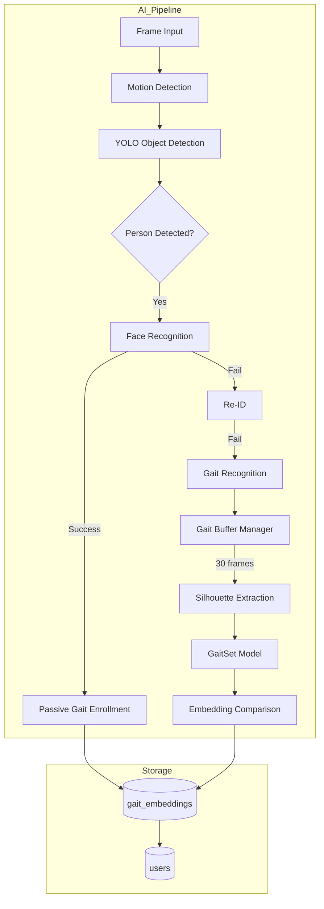

# Design Document: Gait Recognition System

## Overview

Gait Recognition sistemi FacePro tətbiqinə üçüncü tanıma metodu kimi əlavə olunacaq. Bu sistem insanları yeriş xüsusiyyətlərinə görə tanıyır və üz görünmədikdə (arxadan, aşağı baxanda, maska ilə) belə şəxsiyyəti müəyyən etməyə imkan verir.

**Tanıma Prioriteti:**
```
Face Recognition → Re-ID (Bədən/Geyim) → Gait Recognition (Yeriş)
```

## Architecture



## Components and Interfaces

### 1. GaitEngine (`src/core/gait_engine.py`)

```python
class GaitEngine:
    """Yeriş tanıma mühərriki."""
    
    SEQUENCE_LENGTH = 30  # Frame sayı
    SILHOUETTE_SIZE = (64, 64)  # Silhouette ölçüsü
    EMBEDDING_DIM = 256  # Gait embedding ölçüsü
    DEFAULT_THRESHOLD = 0.70
    
    def __init__(self, model_path: Optional[str] = None):
        """Model yüklə (lazy loading)."""
        
    def extract_silhouette(self, frame: np.ndarray, bbox: Tuple) -> np.ndarray:
        """Person bounding box-dan silhouette çıxar."""
        
    def extract_embedding(self, silhouettes: List[np.ndarray]) -> np.ndarray:
        """30 silhouette-dən 256D embedding çıxar."""
        
    def compare_embeddings(self, query: np.ndarray, stored: List) -> Optional[GaitMatch]:
        """Cosine similarity ilə müqayisə."""
```

### 2. GaitBufferManager (`src/core/gait_engine.py`)

```python
class GaitBufferManager:
    """Hər track_id üçün silhouette buffer idarəsi."""
    
    def __init__(self, sequence_length: int = 30, timeout: float = 5.0):
        self._buffers: Dict[int, GaitBuffer] = {}
        
    def add_frame(self, track_id: int, silhouette: np.ndarray) -> bool:
        """Buffer-ə frame əlavə et. 30-a çatdıqda True qaytar."""
        
    def get_sequence(self, track_id: int) -> Optional[List[np.ndarray]]:
        """Tam seqansı qaytar və buffer-i təmizlə."""
        
    def cleanup_stale(self):
        """5 saniyə aktiv olmayan buffer-ləri sil."""
```

### 3. Integration with AIWorker

```python
# ai_thread.py-da əlavə
class AIWorker(QThread):
    def __init__(self):
        # Mövcud komponentlər
        self._face_recognizer = FaceRecognizer()
        self._reid_engine = get_reid_engine()
        # Yeni
        self._gait_engine = get_gait_engine()
        self._gait_buffer = GaitBufferManager()
        
    def _process_frame(self, frame, camera_name):
        # ... mövcud kod ...
        
        if detection.type == DetectionType.PERSON:
            # 1. Face Recognition
            name, user_id, conf, face_visible = self._face_recognizer.recognize(...)
            
            if name:
                # Passive Gait Enrollment
                self._enroll_gait(frame, detection.bbox, user_id)
            else:
                # 2. Re-ID
                match = self._reid_engine.compare_embeddings(...)
                
                if not match:
                    # 3. Gait Recognition
                    gait_match = self._try_gait_recognition(frame, detection, track_id)
```

## Data Models

### Database Schema (əlavə cədvəl)

```sql
-- Gait Embeddings (Yeriş vektorları)
CREATE TABLE IF NOT EXISTS gait_embeddings (
    id INTEGER PRIMARY KEY AUTOINCREMENT,
    user_id INTEGER NOT NULL,
    embedding BLOB NOT NULL,      -- 256D vektor (pickle)
    confidence REAL DEFAULT 1.0,
    captured_at TIMESTAMP DEFAULT CURRENT_TIMESTAMP,
    FOREIGN KEY(user_id) REFERENCES users(id) ON DELETE CASCADE
);

-- Index for faster lookups
CREATE INDEX IF NOT EXISTS idx_gait_user ON gait_embeddings(user_id);
```

### Data Classes

```python
@dataclass
class GaitBuffer:
    """Bir şəxs üçün silhouette buffer."""
    track_id: int
    silhouettes: List[np.ndarray]
    last_update: float  # timestamp
    
@dataclass
class GaitMatch:
    """Gait tanıma nəticəsi."""
    user_id: int
    user_name: str
    confidence: float
    embedding_id: int
```

## Correctness Properties

*A property is a characteristic or behavior that should hold true across all valid executions of a system-essentially, a formal statement about what the system should do. Properties serve as the bridge between human-readable specifications and machine-verifiable correctness guarantees.*

### Property 1: Confidence Score Range
*For any* gait analysis result, the confidence score SHALL always be between 0.0 and 1.0 inclusive.
**Validates: Requirements 1.3**

### Property 2: Buffer Sequence Length
*For any* gait buffer, analysis SHALL only be triggered when exactly 30 frames have been collected.
**Validates: Requirements 1.2**

### Property 3: Silhouette Size Consistency
*For any* extracted silhouette, the output dimensions SHALL always be 64x64 pixels.
**Validates: Requirements 6.2**

### Property 4: Embedding Serialization Round-Trip
*For any* gait embedding, serializing with pickle and then deserializing SHALL produce an identical numpy array.
**Validates: Requirements 7.4**

### Property 5: Cosine Similarity Symmetry
*For any* two embeddings A and B, cosine_similarity(A, B) SHALL equal cosine_similarity(B, A).
**Validates: Requirements 7.3**

### Property 6: Maximum Embeddings Per User
*For any* user, the gait_embeddings table SHALL contain at most 10 entries.
**Validates: Requirements 2.3, 2.4**

### Property 7: Buffer Isolation
*For any* two different track_ids, adding frames to one buffer SHALL NOT affect the other buffer.
**Validates: Requirements 3.3**

### Property 8: Label Format Correctness
*For any* gait identification with confidence > threshold, the label SHALL match the pattern "Name (Gait: XX%)".
**Validates: Requirements 1.4, 4.2**

### Property 9: Threshold Configuration
*For any* configured threshold value, only matches with confidence >= threshold SHALL be returned.
**Validates: Requirements 5.2**

### Property 10: Passive Enrollment Association
*For any* passive enrollment triggered by face recognition, the stored gait embedding SHALL have the same user_id as the face recognition result.
**Validates: Requirements 2.1, 2.2**

## Error Handling

| Scenario | Handling |
|----------|----------|
| Model file missing | Use pretrained GaitSet from torch hub, log warning |
| Silhouette extraction fails | Skip frame, continue collecting |
| Buffer timeout | Clear buffer, start fresh |
| Database write fails | Log error, keep in-memory only |
| CPU > 80% | Skip gait analysis, rely on Re-ID |

## Testing Strategy

### Unit Tests
- Silhouette extraction from various bbox sizes
- Buffer management (add, get, cleanup)
- Embedding comparison logic
- Label formatting

### Property-Based Tests (fast-check/hypothesis)
- **Library:** `hypothesis` for Python
- **Minimum iterations:** 100 per property
- Each property test tagged with: `**Feature: gait-recognition, Property {N}: {description}**`

### Integration Tests
- Full pipeline: Frame → Detection → Gait → Match
- Database persistence across restarts
- Multi-person tracking with separate buffers
