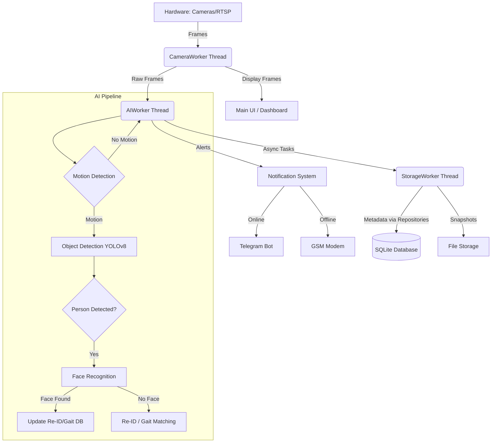

# FacePro System Overview & Handover

**Version:** 1.0 (MVP)
**Date:** 2025-12-22
**Maintained By:** NurMurDev

## 1. Executive Summary
FacePro is an offline-first, local AI security system designed to upgrade legacy camera infrastructure (RTSP/DVR) into a smart surveillance solution. It features real-time object detection (YOLOv8), face recognition, person re-identification (Re-ID) for when faces are not visible, and gait recognition.

**Key Value Props:**
- **Privacy-First:** No cloud dependecy; all data stays on the local machine.
- **Offline Operations:** GSM Modem fallback for SMS alerts when internet is down.
- **Hardware Lock:** Anti-piracy protection using hardware-bound license keys.
- **Passive Enrollment:** Automatically learns body features (Re-ID) and gait patterns from recognized faces.

---

## 2. System Architecture

The application is built using **Python 3.10+** and **PyQt6**, following a modular Model-View-Controller (MVC) adaptation for desktop.

### 2.1. High-Level Diagram


### 2.2. Core Modules (`src/`)
| Module | Description | key Files |
| :--- | :--- | :--- |
| **`core`** | The AI brain. Handles all processing, threading, and logic. | `ai_thread.py`, `reid_engine.py`, `gait_engine.py` |
| **`ui`** | User Interface built with PyQt6. | `main_window.py`, `dashboard/`, `settings/` |
| **`hardware`** | Physical device interfaces. | `gsm_modem.py`, `telegram_notifier.py` |
| **`utils`** | Shared helpers, logging, authentication. | `auth_manager.py`, `license_manager.py`, `logger.py` |

---

## 3. Third-Party Integrations & Dependencies

| Service/Lib | Purpose | Implementation Location | Credentials/Env | Risks |
| :--- | :--- | :--- | :--- | :--- |
| **Ultralytics YOLO** | Person detection model. | `src/core/object_detector.py` | None (Local .pt file) | Version updates can break API. |
| **dlib / face_recognition** | Facial recognition. | `src/core/face_recognizer.py` | None (Local models) | Dependency hell on Windows (Visual Studio C++ require). |
| **Telegram Bot API** | Sending real-time photo alerts. | `src/hardware/telegram_notifier.py` | `settings.json` > `telegram.bot_token` | Rate limits, Internet dependency. |
| **PySerial** | COM port communication for GSM Modem. | `src/hardware/gsm_modem.py` | `settings.json` > `gsm.com_port` | Driver compatibility issues. |
| **PyQt6** | GUI Framework. | `src/ui/` | None | LGPL License considerations. |
| **PyInstaller** | Packaging python code into .exe. | `build_exe.py` (Missing?), `installer_gui.py` | None | False positives from Antivirus. |

---

## 4. Security & Vulnerability Audit

### 4.1. Security Strengths
*   **No Cloud Leaks:** All data is stored in `data/db/facepro.db` and is not uploaded anywhere.
*   **Secure Serialization:** `pickle` has been largely removed in favor of `numpy.tobytes()` and `numpy.frombuffer()` in `reid_engine.py` and `gait_engine.py` to prevent arbitrary code execution vulnerabilities.
*   **Password Hashing:** `AuthManager` uses `bcrypt` for user passwords (secure against brute-force).
*   **Hardware Lock:** Licensing is tied to CPU/Motherboard ID using SHA-256.

### 4.2. Vulnerabilities & Findings
1.  **Secret Salt Management (Medium Risk):**
    *   `admin_keygen.py` and `license_manager.py` rely on `FACEPRO_LICENSE_SALT`. If this environment variable is lost, you cannot generate valid keys for existing installations.
    *   **Fix:** Store the salt in a secure password manager (Bitwarden/1Password) immediately.
2.  **Hardcoded Paths / Missing Build Script (Low Risk):**
    *   `build_exe.py` was referenced in docs but is missing from the root. `installer_gui.py` exists but depends on a pre-built `payload.zip`.
    *   **Fix:** Re-create or locate the standard `pyinstaller` build script to ensure reproducible builds.
3.  **Telegram Token exposure (User Error Risk):**
    *   The token is stored in plain text in `settings.json`.
    *   **Fix:** Acceptable for a desktop app (user owns the machine), but ensure `settings.json` is strictly `gitignore`d (which it is).
4.  **Installer Dependencies:**
    *   `installer_gui.py` uses `tkinter`. While standard on Windows, some minimal Python installs skip it.
    *   **Recommendation:** Verify `tkinter` presence or compile `installer_gui.py` to an exe as well.

---

## 5. Developer Guide (Onboarding)

### 5.1. Prerequisites
*   Python 3.10 or 3.11 (Avoid 3.12+ for now due to `dlib`/`torch` potential compatibility delays).
*   Visual Studio Build Tools (C++ Compiler) - Required for `dlib`.
*   Git.

### 5.2. Setup Instructions
1.  **Clone & Venv:**
    ```bash
    git clone <repo_url>
    cd facepro
    python -m venv venv
    venv\Scripts\activate
    ```
2.  **Install Dependencies:**
    ```bash
    pip install -r requirements.txt
    ```
    *Note: If `dlib` fails, install CMake (`pip install cmake`) and ensure VS Build Tools are installed.*
3.  **Environment Setup:**
    *   Copy `config/settings.template.json` to `config/settings.json`.
    *   Set `FACEPRO_LICENSE_SALT` env var (for license testing).
4.  **Run Application:**
    ```bash
    python main.py
    ```

### 5.3. Development Tips
*   **Logs:** Check console output (colored logs) or `FacePro.log` (if file logging enabled).
*   **Database:** You can open `data/db/facepro.db` with "DB Browser for SQLite".
*   **Safe Mode:** To bypass hardware lock during dev, you can use `debug_key.py` or comment out the check in `main.py` (not recommended, better to generate a valid key for your dev machine).

---

## 6. Deployment Pipeline

The project uses a two-step build process:
1.  **Compile to EXE:** Use `PyInstaller` to create a single file or directory distribution.
    ```bash
    pyinstaller main.py --name "FacePro" --windowed --icon "assets/icon.ico" --add-data "assets;assets" --add-data "models;models" --add-data "config/settings.template.json;config"
    ```
2.  **Create Installer:**
    *   Zip the output folder (`dist/FacePro`) into `payload.zip`.
    *   Run `installer_gui.py` (can also be compiled) which unzips `payload.zip` to `%LOCALAPPDATA%` and creates shortcuts.

---

## 7. Next Steps & Roadmap

### Priority 1: Critical Fixes (Immediate)
- [ ] **Restore Build Script:** Create a robust `build.py` script that automates PyInstaller + Zip steps to replace the missing `build_exe.py`.
- [ ] **Backup Salt:** Ensure the Production License Salt is backed up globally.
- [ ] **Test Migration:** Verify `migrate_embeddings.py` works correctly for upgrading any legacy (pickle-based) databases if they exist.

### Priority 2: Mid-Term Improvements
- [ ] **Optimize `dlib`:** Replace `dlib` with `RetinaFace` or `InsightFace` (ONNX) for faster, lighter face recognition without C++ compilation requirements.
- [ ] **Settings UI:** Expand `SettingsDialog` to include Re-ID threshold sliders and Telegram test buttons (if not fully implemented).

### Priority 3: Long-Term Scaling
- [ ] **RTSP Server:** Implement a lightweight internal RTSP restreamer to allow viewing the processed feed (with bounding boxes) on external players/apps.
- [ ] **Cloud Connector:** Optional module to sync metadata (not video) to a cloud dashboard for multi-site customers.
